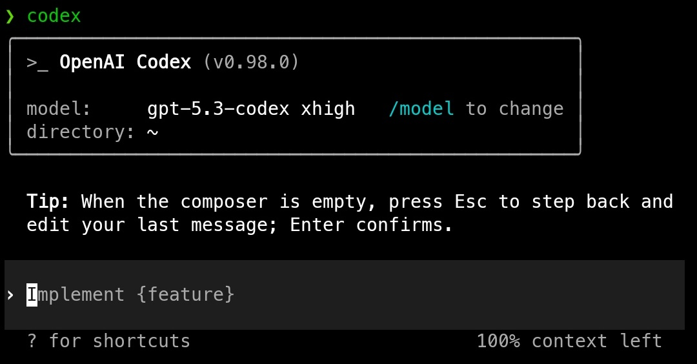

# Codex CLI for Termux

> A Termux-first fork of OpenAI Codex with architecture-specific native packages for every common Termux CPU architecture.

[](https://www.npmjs.org/package/@sirvkrm/codex-cli-termux)



## About

This repository is a fork of [OpenAI Codex](https://github.com/openai/codex) packaged specifically for Android Termux.

GitHub: https://github.com/sirvkrm/codex-vkrm

It is designed for Termux, not desktop Linux distributions, and currently ships:

- Android only
- `arm64`
- `armv7`
- `x86_64`
- `x86`
- minimal compatibility patches only
- no deliberate behavior changes beyond making it run on Termux

This packaging work is community-maintained and is inspired by [DioNanos](https://github.com/DioNanos), whose earlier Termux-focused distribution helped prove out the approach.

## Install

```bash
pkg update && pkg upgrade -y
pkg install nodejs-lts -y

npm install -g @sirvkrm/codex-cli-termux
```

The top-level package installs the matching Android native package for your device automatically.

## Verify

```bash
codex --version
codex login
```

## Package Behavior

- The npm wrapper auto-detects the correct ABI on Android.
- It selects the matching architecture-specific native package at runtime.
- It sets `LD_LIBRARY_PATH` so the packaged `libc++_shared.so` is found automatically.

## Build From Source

See [BUILDING.md](/root/codex-termux/BUILDING.md).

The Rust workspace lives in [codex-rs](/root/codex-termux/codex-rs) and the npm wrapper lives in [npm-package](/root/codex-termux/npm-package).

## Documentation

- [docs/installation.md](/root/codex-termux/docs/installation.md)
- [docs/testing.md](/root/codex-termux/docs/testing.md)
- [docs/termux-upgrade-checks.md](/root/codex-termux/docs/termux-upgrade-checks.md)
- [patches/README.md](/root/codex-termux/patches/README.md)

## Maintenance

This is a community-maintained Termux packaging fork. The goal is to keep upstream Codex usable across the full set of common Termux Android architectures while staying as close to upstream as practical.

## License

Apache-2.0.

Original project: OpenAI Codex  
Inspiration: [DioNanos](https://github.com/DioNanos)  
Termux packaging: community-maintained
